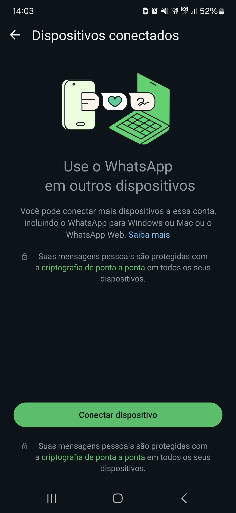

<p align="center">
  
</p>


## Description

Service for manager and send messages to specific devices.

- **Whatsapp**: It emulate an webclient of the platform, to keep the user logged-in and send messages without the whatsapp API.

## Project setup

```bash
$ npm install
```

## Compile and run the project

```bash
# development
$ npm run start

# watch mode
$ npm run start:dev

# production mode
$ npm run start:prod
```

## Run tests

```bash
# unit tests
$ npm run test

# e2e tests
$ npm run test:e2e

# test coverage
$ npm run test:cov
```

## Deployment

When you're ready to deploy your NestJS application to production, there are some key steps you can take to ensure it runs as efficiently as possible. Check out the [deployment documentation](https://docs.nestjs.com/deployment) for more information.

If you are looking for a cloud-based platform to deploy your NestJS application, check out [Mau](https://mau.nestjs.com), our official platform for deploying NestJS applications on AWS. Mau makes deployment straightforward and fast, requiring just a few simple steps:

```bash
$ npm install -g mau
$ mau deploy
```

With Mau, you can deploy your application in just a few clicks, allowing you to focus on building features rather than managing infrastructure.

## Server requirements

- nodejs v20.+

https://pptr.dev/troubleshooting#chrome-doesnt-launch-on-linux

```bash
  $ apt-get update
  $ apt-get install -yq gconf-service libasound2 libatk1.0-0 libc6 libcairo2
    libcups2 libdbus-1-3 libexpat1 libfontconfig1 libgbm1 libgcc1 libgconf-2-4
    libgdk-pixbuf2.0-0 libglib2.0-0 libgtk-3-0 libnspr4 libpango-1.0-0
    libpangocairo-1.0-0 libstdc++6 libx11-6 libx11-xcb1 libxcb1 libxcomposite1
    libxcursor1 libxdamage1 libxext6 libxfixes3 libxi6 libxrandr2 libxrender1
    libxss1 libxtst6 ca-certificates fonts-liberation libnss3 lsb-release
    xdg-utils wget
```

## Project endpoints

1. After the application stats, this route will be accessible:

```bash
curl --request GET \
  --url http://localhost:9000/whatsapp/qrcode \
  --header 'Content-Type: application/json' 
```
2. After open whatsapp app, and click on "Connected devices", will show this screen: 

<p align="center">
  
</p>

3. Scan the generated qrCode and allow the device to use your account.

4. Sending messages:

```bash
curl --request POST \
  --url http://localhost:9000/whatsapp/message \
  --header 'Content-Type: application/json' \
  --data '{
	"phoneNumber": "5551990000000",
	"text": "Mensagem automática de testes!"
}'
```


## TODO List
- [ ] Send SMS
- [ ] Send E-mails
- [ ] Mobile push communication protocol
- [ ] Run on Docker
- [ ] Integrate with RabbitMQ

